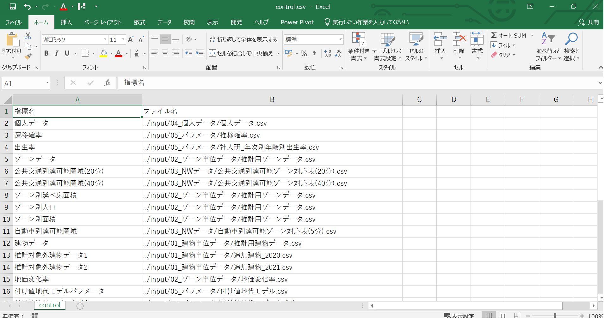
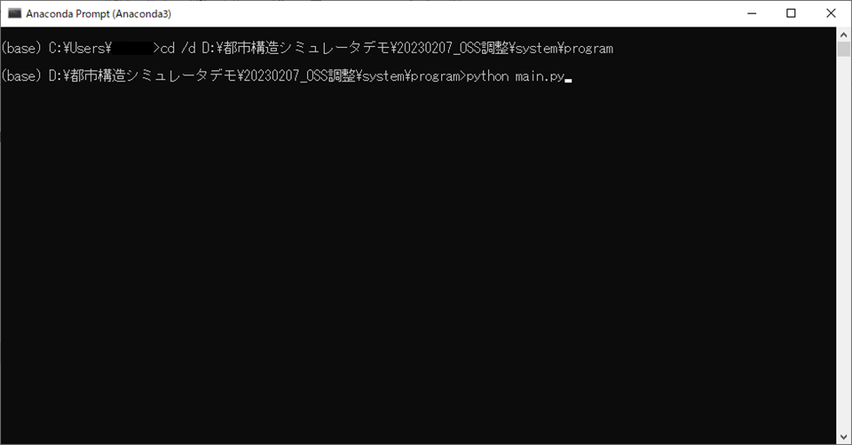
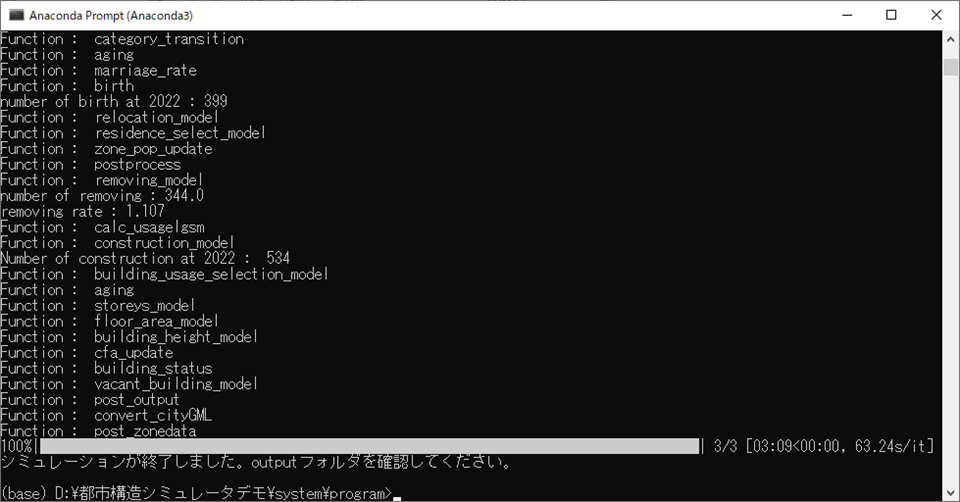

# FY2022 Project PLATEAU UC-020「都市構造シミュレーション」の成果物


# 概要

3D都市モデルの建築物モデルと、その他各種データをインプットデータとして、将来の建築物の建て替え、人口、地価、空き家率を推計し、将来時点の建築物の有無、用途、高さ、個人の居住地、ゾーンの地価等をシミュレーションするシステムです。


# 「都市構造シミュレーション」について

## ユースケースの概要

令和4年度の3D 都市モデルを活用した社会的課題解決型ユースケース開発業務「都市構造シミュレーション」では、3D都市モデルを活用し、コンパクトシティ等の短期的に成果が見えにくいまちづくり施策が都市構造に与える影響をわかりやすく可視化する都市構造シミュレータを開発しました。

## 開発システムの概要

- 本システムは、3D都市モデルの建築物モデル（CityGML形式）をベースに作成した建築物データのほか、交通データ（国勢調査小地域を基本とするゾーン間の自動車所要時間及び公共交通所要時間や最寄り駅距離）、個人データ（個人ごとの世帯・個人属性と居住地）等をインプットデータとして、将来の建築物の建て替え、人口、地価、空き家率を推計する複数のサブモデル群により構成された、マイクロシミュレーションを実行するシステムです。
- サブモデルには、将来のゾーン単位の地価を推計する「地価モデル」機能、将来の個人の居住地をゾーン単位で推計する「居住地選択モデル」機能、将来のゾーン単位の空き家率を推計する「空き家率モデル」機能、将来の建築物一つ一つの除却・建設・用途を推計する「建替・用途選択モデル」機能の４つがあります。
- 処理の順番としては、まずインプットデータを読み込み、次にサブモデルによる演算を順に実行します。その際、先に実行した演算結果を、以降に実行する演算のインプットデータとして用いるため、システム内部でゾーン別人口やゾーン別地価、建築物の有無、用途、高さといったデータを保持し、各演算が終わるごとにこれらのデータを更新します。
- 本システムでは、将来時点1年ごとに各演算を実行します。その年の演算が全て完了すると、その年の建築物の有無、用途、高さ、個人別の居住地、ゾーン別の地価等のアウトプットデータを出力したのち、次の年に進んで再び各演算を実行します。これらの処理は、pythonで記述されたプログラムのメイン関数を実行することで、自動的に行われます。
- 本システムは、一般財団法人計量計画研究所及び国際航業株式会社が共同で作成・開発したものです。

参考資料
- [アルゴリズムの考え方（技術検証レポート、PDF）](//URLス最後に変更)
- [スクリプト本体](/system/program/)
- [インプットデータとアウトプットデータの仕様(PDF)](//パス最後に変更)
- [インプットデータ作成方法(PDF)](//パス最後に変更)
- [サンプルデータ](/system/input/)

### 動作環境

都市構造シミュレーションを実行するには、pythonがインストールされ、必要なライブラリがインストールされている必要があります。

OS：Windows10

言語：python 3.9.12

ライブラリ：

- pandas : 1.4.3
- numpy : 1.21.5
- chardet : 5.1.0
- tqdm : 4.64.0

### 都市構造シミュレータの構成

都市構造シミュレータは、以下のようなフォルダー構成になっています。

```markdown
└─system
    ├─input
    │  ├─01_建物単位データ
    │  ├─02_ゾーン単位データ
    │  ├─03_NWデータ
    │  ├─04_個人データ
    │  └─05_パラメータ
    ├─output
    │  ├─01_年次集計
    │  │  ├─年次別ゾーンデータ
    │  │  ├─年次別個人データ
    │  │  └─年次別建物データ
    │  └─02_cityGMLデータ
    │      └─cityGML用建物データ
    ├─program
    │  ├─building
    │  ├─life_event
    │  └─submodule
    └─setting
```

- **input**　フォルダー<p></p>
都市構造シミュレータのインプットデータを保存する場所です。データの種類ごとに、01~05のフォルダに分けています。
- **output**　フォルダー<p></p>
シミュレーション結果が出力されるフォルダです。都市構造シミュレータは、実行時にoutputフォルダが存在しなければ作成し、存在すればその中のファイルを上書きする形でシミュレーション結果を出力します。既に存在するシミュレーション結果を上書きしたくない場合は、「output」以外の名称にフォルダを変更すれば、上書きはされません。
- **program**　フォルダー<p></p>
都市構造シミュレータのpythonコードを保存しています。都市構造シミュレータを実行するには、このフォルダ内の`main.py`を実行します。
- **setting**　フォルダー<p></p>
都市構造シミュレータのインプットデータのパス、及び都市構造シミュレータの設定を行うファイルを保存する場所です。

# 利用手順

## 環境構築

### pythonのインストール

[anaconda（推奨）](https://www.anaconda.com/products/distribution)または[python](https://www.python.org/downloads/)がインストールされていない場合、インストールします。

### ライブラリのインストール（anacondaを使用する場合）

必要なライブラリは全て標準でインストールされているため、追加のインストールは不要です。

### ライブラリのインストール（pythonを使用する場合）

必要なライブラリをインストールします。インストール方法の詳細は、各ライブラリのマニュアルを参照してください。

pandasをインストールする場合（[pandasのインストールマニュアル](https://pandas.pydata.org/docs/getting_started/install.html)）
```
pip install pandas
```
numpyをインストールする場合（[numpyのインストールマニュアル](https://numpy.org/install/)）
```
pip install numpy
```
chardetをインストールする場合（[chardetのインストールマニュアル](https://pypi.org/project/chardet/)）
```
pip install chardet
```
tqdmをインストールする場合（[tqdmのインストールマニュアル](https://pypi.org/project/tqdm/#installation)）
```
pip install tqdm
```

## インストール方法

[都市構造シミュレータ](system)をダウンロードし、任意の場所に保存してください。

## アンインストール方法

「インストール方法」で保存したフォルダーを削除することで、アンインストールすることができます。

## 使い方

シミュレーション実行までの操作手順は、以下の通りです。

1. 設定ファイルの確認をします。設定ファイルは、`setting/control.csv`、`setting/setting.csv`、`setting/output_setting.csv`の３つがあります。<p></p>
`contorol.csv`は、インプットデータのパスを指定するファイルです。2列目でインプットデータのパスを指定します。インプットデータを差し替える場合は、インプットデータとアウトプットデータの仕様について記載している[input_output_specification.pdf](input_output_specification.pdf)に従ってファイルを作成し、`input`フォルダに保存した上で、パスの指定を変更してください。<p></p>
    <p></p>
`setting.csv`では、シミュレーションの終了年次を指定することができます。2021年～2040年の間で指定可能です。csvファイルの2列目のみ変更可能です。1列目は変更しないでください。<p></p>
`output_setting.csv`では、シミュレーション結果の出力有無を設定することができます。4つのデータについて、それぞれ出力の有無を指定可能です。2列目で、出力したいデータは「T」を入力、出力不要なデータが「F」を入力してください。デフォルトでは全て「T」になっています。1列目は変更しないでください。


2. コマンドラインを起動します。anacondaをインストールしている場合はanaconda promptを、そうでない場合はコマンドプロンプトを起動します。`main.py`のおいてあるprogramフォルダに`cd`コマンドで移動します。`python main.py` と入力し、Enterキーを押下すると、都市構造シミュレータが実行されます。

    

3. `シミュレーションが終了しました。outputフォルダを確認してください。`が表示されると、シミュレーションの演算が終了したことを意味します。`output`フォルダにアウトプットデータが出力されているので、確認してください。

    

# インプットデータについて

## 個人単位データ「individual_data.csv」について

個人単位データ「individual_data.csv」は、令和4年度開発ユースケース「都市構造シミュレーション」では宇都宮市から貸与を受けたパーソントリップ調査の調査票情報を用いて作成しましたが、本データは非公表データであるため、ここでは動作確認用のダミーデータを公開しています。実際の宇都宮市の人口分布等とは整合しません。

## インプットデータの加工方法について

インプットデータの作成方法を、[インプットデータ作成方法](input_data_processing_method.pdf)に記載しています。ご自身でインプットデータを作成したい場合、必要に応じてご参考ください。

# ライセンス

- ソースコードおよび関連ドキュメントの著作権は国土交通省に帰属します。
- 本ドキュメントは[Project PLATEAUのサイトポリシー](https://www.mlit.go.jp/plateau/site-policy/)（CCBY4.0および政府標準利用規約2.0）に従い提供されています。

# 注意事項

- 本リポジトリは参考資料として提供しているものです。動作保証は行っておりません。
- 予告なく変更・削除する可能性があります。
- 本リポジトリの利用により生じた損失及び損害等について、国土交通省はいかなる責任も負わないものとします。

# 参考資料

- (近日公開)技術検証レポート: https://www.mlit.go.jp/plateau/libraries/technical-reports/
- PLATEAU Webサイト Use caseページ「都市構造シミュレーション」: https://www.mlit.go.jp/plateau/use-case/
- anaconda : https://www.anaconda.com/
- python : https://www.python.org/
